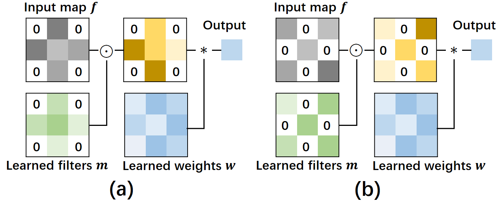
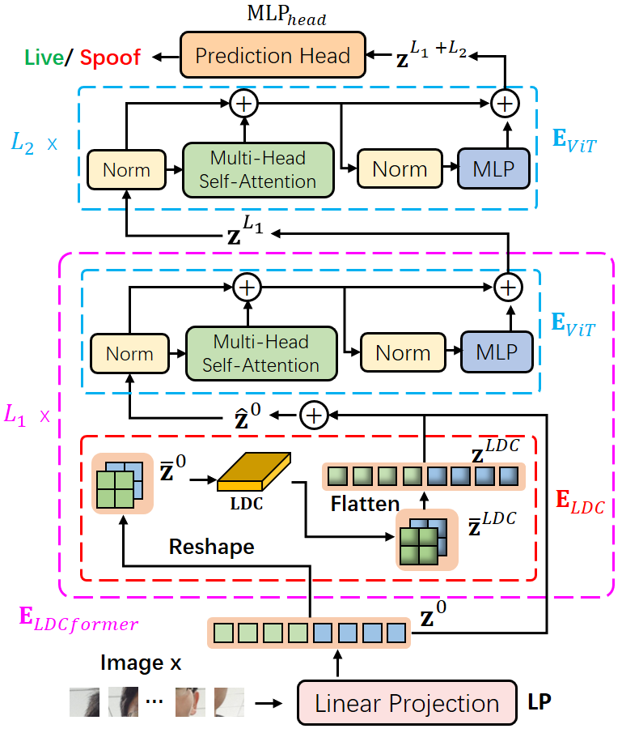
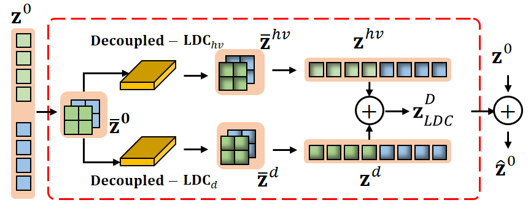

# LDCformer
### LDCformer: Incorporating Learnable Descriptive Convolution to Vision Transformer for Face Anti-Spoofing (ICIP '23)

## Decoupled Learnable Descriptive Convolution (Decoupled -LDC)


## Architecture of LDCformer


## Architecture of Decoupled-LDC Block


## Requirements
```
numpy==1.23.3
pytz==2022.4
requests==2.28.1
scikit_learn==1.2.0
timm==0.6.7
torch==1.10.1
torchvision==0.11.2
```

## Training & Testing
Run `train.py` to train DCViT

Run `test.py` to test DCViT

## Citation

If you use the DC-LDC, please cite the paper:

```

```
